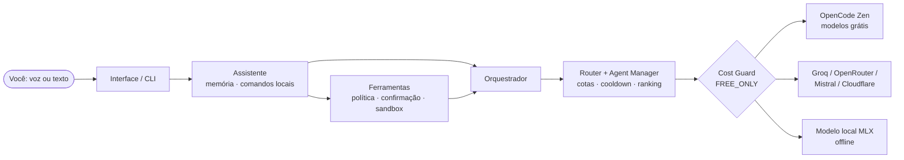

# J.A.R.V.I.S.

[](https://github.com/albanopedro/IAcode/actions/workflows/ci.yml)

Assistente pessoal **por voz**, inspirado no JARVIS do Homem de Ferro, que conversa com
vários agentes de IA **100% gratuitos** e troca de agente sozinho quando um atinge o
limite, falha ou fica offline. Sem internet, um modelo **local** assume.

> **Regra absoluta: custo zero.** `COST_MODE=FREE_ONLY` é o padrão e só muda pelo
> ambiente. Agentes pagos ficam bloqueados; um provedor que informar custo maior que zero
> ou responder "402" é bloqueado na hora, e o bloqueio sobrevive a reinícios.

## Destaques

- **Multiagente com fallback inteligente:** o roteador pontua os agentes por
  capacidade para a tarefa, prioridade, taxa de sucesso, latência e privacidade, e
  respeita cotas por minuto e por dia antes de o provedor recusar.
- **Voz local:** whisper.cpp (fala → texto) e `say` do macOS ou Piper (texto → fala),
  conversa contínua, respostas curtas para ouvir.
- **"Hey Jarvis":** o JARVIS dorme até ouvir a palavra-chave (pronúncia em inglês),
  conversa e volta a dormir depois de um silêncio ou de "tchau JARVIS". Enquanto ele
  dorme, o áudio é analisado localmente e descartado: nada é gravado nem enviado.
- **Interromper falando:** diga "Hey Jarvis" no meio da resposta (ou aperte Esc na
  interface) e o JARVIS para e ouve você.
- **Interface** com orb animado, estados (ouvindo, pensando, falando), voz no navegador,
  painel de agentes, histórico e memória.
- **Memória:** histórico salvo, resumo automático de conversas longas e lembranças que
  você pede ("JARVIS, lembre que…"), enviadas só a agentes que não retêm dados.
- **Ferramentas seguras:** calculadora, Wikipédia, páginas web, tarefas, arquivos e
  Python numa sandbox do macOS, com permissões, confirmação, limites e auditoria.
- **IA local e modo privado:** modelo Qwen3-4B via MLX como reserva offline, e o modo
  "🔒 só local", em que nada sai do Mac.

## Começar

**Mais fácil (macOS):** dê dois cliques em **`JARVIS.command`**. Na primeira vez ele cria
o ambiente e compila a interface; depois abre http://127.0.0.1:8300.

**Manual:**

```bash
cd backend
python3 -m venv .venv
.venv/bin/pip install -e ".[server,voice,local,dev]"
cd ../web && npm install && npm run build && cd ../backend
.venv/bin/python -m jarvis doctor          # o que está pronto e o que falta
.venv/bin/python -m jarvis local download  # opcional: modelo offline (~2,3 GB)
.venv/bin/python -m jarvis serve --open    # interface em http://127.0.0.1:8300
```

Requisitos: macOS com Apple Silicon (para a IA local e a sandbox), Python 3.12+,
Node 20+ e, para os modelos gratuitos do OpenCode Zen, o [OpenCode](https://opencode.ai)
instalado.

### Agentes online opcionais

Copie `.env.example` para `.env` e preencha só o que quiser. Use contas no **plano
grátis, sem cartão cadastrado**:

| Variável | Serviço | Limite gratuito |
|---|---|---|
| `GROQ_API_KEY` | Groq (plano Free) | ~30/min, ~1.000/dia por modelo |
| `OPENROUTER_API_KEY` | OpenRouter (só modelos `:free`) | 20/min, 50/dia; nunca compre créditos |
| `MISTRAL_API_KEY` | Mistral (plano Experiment) | ~1/s; pode treinar com seus dados (dá para desligar) |
| `CLOUDFLARE_ACCOUNT_ID` e `CLOUDFLARE_API_TOKEN` | Workers AI (Free) | 10.000 Neurons/dia; passou disso, falha em vez de cobrar |

Sem chave, o agente fica ⚪ "sem chave" e o JARVIS segue com os outros.

## Comandos

| Comando | O que faz |
|---|---|
| `jarvis serve [--open] [--port N]` | Interface web (só em 127.0.0.1) |
| `jarvis chat [--continue] [--local]` | Conversa no terminal (`/status`, `/limpar`, `/sair`) |
| `jarvis ask "…" [--local]` | Uma pergunta |
| `jarvis voice [--wake] [--tts piper] [--once]` | Conversa por voz no terminal (`--wake`: acorda com "Hey Jarvis") |
| `jarvis status [--json]` | Saúde e cotas dos agentes (não gasta cota) |
| `jarvis doctor` | Diagnóstico da instalação (nunca mostra chaves) |
| `jarvis memory list \| add \| forget \| clear` | Lembranças de longo prazo |
| `jarvis history list \| show \| clear` | Conversas salvas |
| `jarvis tools list \| log` | Ferramentas, políticas e log de auditoria |
| `jarvis local status \| download \| remove` | Modelo offline |
| `jarvis unblock <id>` | Libera um agente bloqueado por custo |
| `jarvis speak "…"` / `jarvis transcribe a.wav` | Testar a voz |

## Como funciona



Os detalhes de cada camada estão em [docs/architecture.md](docs/architecture.md) e o
modelo de segurança está em [SECURITY.md](SECURITY.md).

## Privacidade, em resumo

- **Tudo fica no seu Mac:** histórico, lembranças, contadores e auditoria ficam em
  `data/`, uma pasta que o git ignora. As chaves ficam só no `.env`.
- **O que sai:** só a conversa, e só para o agente que responde. As lembranças de longo
  prazo vão apenas para agentes de retenção zero ou locais.
- **Modo "🔒 só local":** nada sai do Mac, nem depois. As mensagens desse modo nunca
  entram no contexto de agentes online nem nos resumos.
- **Voz:** fala → texto e texto → fala rodam localmente.

## Desenvolvimento

```bash
cd backend && .venv/bin/pytest            # testes (os reais, opcionais: JARVIS_LIVE_TESTS=1 -m live)
.venv/bin/ruff check . && .venv/bin/ruff format --check .
cd ../web && npm test && npx tsc --noEmit && npm run build
```

O **CI** (GitHub Actions, gratuito em repositório público) roda lint, testes e build a
cada push, no Linux. Lá, os testes exclusivos do macOS (sandbox, `say`, MLX) pulam
sozinhos.

Para desenvolver a interface: rode `jarvis serve` e, em `web/`, `npm run dev`; a
interface fica em http://127.0.0.1:5300, e o Vite repassa `/api` e `/ws`.

Estrutura:

```text
backend/jarvis/
  core/      orquestrador, router, agent manager, cost guard, conversa, tipos
  agents/    opencode (sandbox), openai_compat (Groq…), local (MLX), factory
  memory/    histórico SQLite, resumo, lembranças, assistente
  tools/     protocolo, executor, auditoria, ferramentas (calculadora, web, arquivos, sandbox…)
  voice/     VAD, whisper.cpp, say/Piper, sessão de voz
  server/    FastAPI + WebSocket
web/src/     React: orb, conversa, agentes, memória, confirmações
config/agents.toml   agentes, limites, voz, memória, ferramentas, IA local (sem segredos)
```

## Limitações conhecidas

- Os modelos gratuitos do OpenCode Zen são "por tempo limitado" e mudam com frequência;
  o JARVIS descobre a lista a cada verificação.
- Só "Hey Jarvis" interrompe o JARVIS falando: sem cancelamento de eco no terminal,
  qualquer fala o faria ouvir a si mesmo. Fale mais alto que o alto-falante ou use fone.
  O streaming é por frase, não por token.
- O VAD por energia sofre em ambiente barulhento. A automação do sistema ficou para
  depois.
- O modelo pronto "hey_jarvis" do openWakeWord é **CC BY-NC-SA 4.0** (uso pessoal, não
  comercial) e foi treinado com a pronúncia inglesa: "Ei Jarvis" com sotaque brasileiro
  quase não acorda. O limiar é ajustável em `[voice] wake_threshold`.
- O modelo local (4B) é mais fraco que os grandes online.

## Licença

O código do JARVIS é [MIT](LICENSE). As dependências e os modelos baixados no primeiro
uso têm licenças próprias e não fazem parte deste repositório:

| Componente | Licença |
|---|---|
| Modelo "hey_jarvis" do openWakeWord (wake word e interrupção) | CC BY-NC-SA 4.0: só uso pessoal, não comercial |
| Piper (`piper-tts`, voz opcional) | GPL-3.0 |
| Vozes do macOS (`say`) | Licença do macOS (Apple) |
| Qwen3-4B (IA local) | Apache-2.0 |
| whisper.cpp, MLX-LM, FastAPI, React | MIT |

O projeto é pessoal. Antes de qualquer uso comercial, revise essas licenças: o modelo da
wake word não permite (desligue `barge_in` e o `--wake` ou treine outro), e as vozes do
macOS seguem os termos da Apple.

Histórico de mudanças: [CHANGELOG.md](CHANGELOG.md).
