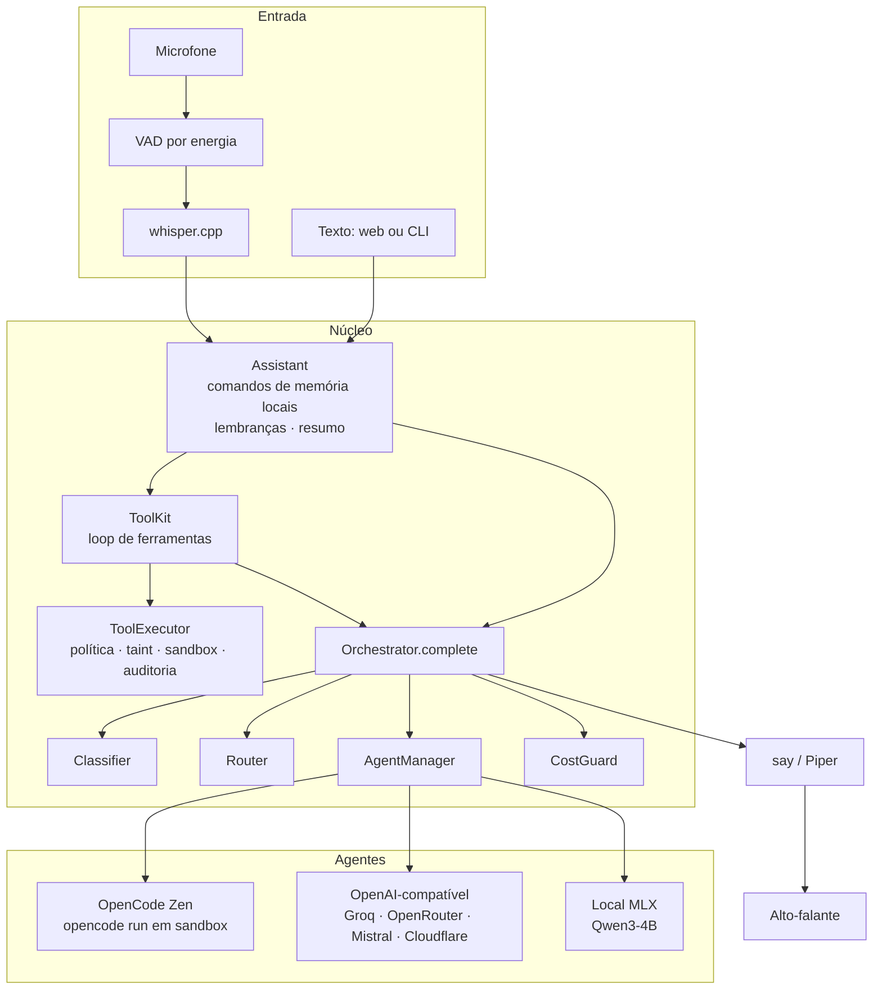

# Arquitetura do JARVIS

## Visão geral



## Fluxo de uma pergunta

1. **Entrada:** texto (web ou CLI) ou voz (o VAD detecta o fim da fala e o whisper.cpp
   transcreve localmente).
2. **Assistant** (`jarvis/memory/assistant.py`):
   - "lembre/esqueça/o que sabe" são resolvidos **localmente**, sem agente;
   - as lembranças relevantes viram *private context*;
   - a conversa ganha a mensagem (marcada como privada no modo "só local").
3. **ToolKit** (quando há ferramentas disponíveis): o agente responde em texto ou pede
   ```` ```tool {"name", "args"} ``` ````. O executor decide, roda, audita e devolve o
   resultado como **dado não confiável**. São até 4 passos, e só a resposta final entra
   no histórico.
4. **Orchestrator.complete:**
   - classifica a tarefa (conversa, código, matemática, pesquisa);
   - pede ao AgentManager os candidatos disponíveis (fora de cooldown, com cota);
   - o Router ordena por pontuação;
   - o CostGuard confere antes e depois de cada chamada;
   - em caso de falha, registra e tenta o próximo.
5. **Saída:** texto (web/CLI) ou voz (dividida em frases; a próxima é sintetizada
   enquanto a atual toca). Enquanto fala, o microfone só procura "Hey Jarvis": ouvir
   a palavra-chave corta a voz e volta a escutar (barge-in).

## Pontuação do Router

```text
score = prioridade
      + 60 × qualidade para a tarefa       (config, ou 0,6 com a capacidade / 0,2 sem)
      − 20 × (1 − taxa de sucesso recente) (últimas 20 chamadas)
      − 15 × falhas seguidas
      −  2 × latência média (s)
      + bônus de privacidade (local 8, retenção zero 5) + local 5
```

Agentes cuja janela de contexto não comporta a conversa são filtrados antes.

## Estados de um agente

| Estado | Quando | Sai do estado |
|---|---|---|
| `available` | verificação ok e fora de cooldown | — |
| `cooldown` | 429, cota diária/por minuto, falhas (backoff de 15 s a 10 min) | sozinho, quando o tempo acaba |
| `offline` | verificação falhou (modelo saiu do catálogo, rede) | na próxima verificação ok |
| `unconfigured` | sem chave, sem binário, modelo local não baixado | depois de configurar |
| `blocked` | cobrança, custo > 0, ferramenta executada | só com `jarvis unblock` (persistido) |

## Dados locais (`data/`, ignorada pelo git)

| Arquivo | Conteúdo |
|---|---|
| `jarvis.db` | contadores de uso por dia, cooldowns, bloqueios (nada de conversas) |
| `memory.db` | conversas (com a marca de privado), resumos, lembranças, tarefas |
| `audit.db` | log de ferramentas (argumentos e resultados truncados) |
| `models/` | whisper.cpp, voz Piper, modelo MLX |

## Decisões principais

| # | Decisão | Por quê |
|---|---|---|
| 1 | Python + FastAPI no backend, React + Vite no frontend | O ecossistema de voz é Python; a interface não precisa de SSR |
| 2 | OpenCode via `opencode run --server`, não pela API HTTP | O Zen recusa o plano grátis fora do cliente oficial; não contornamos |
| 3 | Ferramentas do OpenCode em "ask" (não "deny") | Com "deny" as ferramentas somem e o Zen recusa; com "ask", o modo não interativo as rejeita |
| 4 | Protocolo de ferramentas em texto | Funciona com qualquer agente, inclusive sem *function calling* |
| 5 | whisper.cpp em vez de mlx-whisper | O mlx-whisper puxa o PyTorch (127 MB) |
| 6 | VAD por energia | Sem dependência; um VAD neural pode entrar depois |
| 7 | MLX-LM no venv em vez do Ollama | Sem instalação no sistema; o mais rápido no Apple Silicon (escolha do usuário) |
| 8 | Lembranças só para agentes privados | Provedores grátis podem treinar com os dados |
| 9 | Turnos privados no modo local | Um teste achou o vazamento pelo histórico; a marca é persistida |
| 10 | Bloqueio por custo persistido | Segurança de dinheiro não pode "resetar" sozinha |
